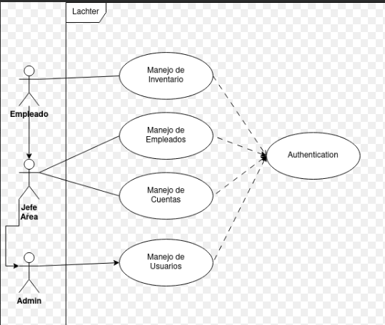
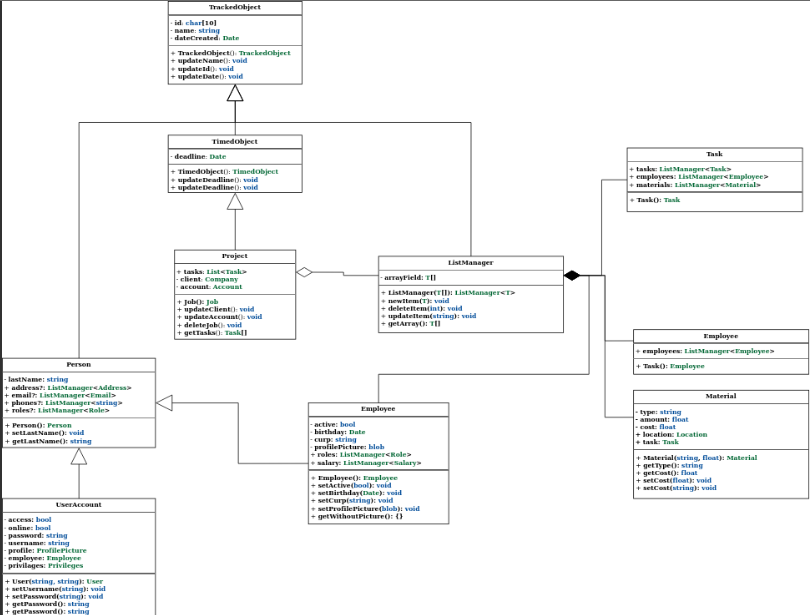

# MANUAL TECNICO

## 1. Requerimientos Tecnicos
### 1.1 Requerimientos minimos de Hardware:
- Procesador: 64 bits.
- Memoria RAM: 4 GBS.

### 1.2 Requerimientos minimos de Software:
- Virtualizacion de hardware habilitada en BIOS.
- Windows 10 o superior.
- Memoria disponible: 20 GB.

## 2. Herramientas Utilizadas para el desarrollo:
### 2.1 MongoDB.
MongoDB es un sistema de gestión de bases de datos no relacional de código abierto que utiliza documentos flexibles en lugar de tablas y filas para procesar y almacenar diversas formas de datos. Como solución de base de datos NoSQL, MongoDB no requiere un sistema de gestión de bases de datos relacionales, por lo que proporciona un modelo de almacenamiento de datos flexible que permite a los usuarios almacenar y consultar tipos de datos multivariados con facilidad.

### 2.2 React.
React es una librería para crear interfaces de usuarios con código abierto, es decir, que está a disposición de cualquier programador para que use sus recursos e incluso haga colaboraciones. Esta biblioteca fue lanzada en el año 2013, por los desarrolladores de Facebook, con base en el lenguaje JavaScript.

### 2.3 Docker
Docker es un software de código abierto utilizado para desplegar aplicaciones dentro de contenedores virtuales. La contenerización permite que varias aplicaciones funcionen en diferentes entornos complejos. Por ejemplo, Docker permite ejecutar el sistema de gestión de contenidos WordPress en sistemas Windows, Linux y macOS sin ningún problema.

### 2.4 Doc NET 7
Se trata de una plataforma para el desarrollo de software que fue lanzada por Microsoft con la finalidad de fusionar su amplio catálogo de productos, que va desde sus múltiples sistemas operativos hasta herramientas de desarrollo. Desde un punto de vista tecnológico, lo que se pretendía con la creación de .NET era poder desarrollar aplicaciones y sistemas que fueran independientes de la arquitectura física y del sistema operativo sobre el que se ejecutaran. La repercusión fue muy  grande, ya que Microsoft estableció un estándar de intercambio de información entre sus productos llamado “XML”, que posiblemente a muchos de vosotros os suene.

## 3. Casos de Uso.
Dentro del sistema se identificaron a los 3 tipos de usuario que harán uso de este, con las acciónes que cada uno de ellos tiene permitido realizar:
- Empleado: Es el tipo de usuario más cómun y en consecuencia el que posee más existencias, pero funciones más limitadas, pues solo se considera que este podra ver actividades a realizar y tendra acceso a manejo de inventario.
- Jefe de área: El jefe de área sera un usuario con acceso a más actividades como lo es la dirección de proyectos, las asignar y supervisar las actividades de los empleados ademas de tener acceso al inventario.
- Administrador: El administrador es el unico usuario que obtiene reportes de todo proseso que se lleva a cabo dentro de la empresay principalmente el manejo de los usuarios del sistema.

## 4. Modelo.

